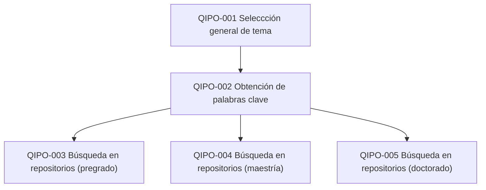

# Diagrama de trazabilidad QIPO/QIPOEC

```mermaid
graph TD
    QIPO-001["QIPO-001 Seleccción general de tema"]
    QIPO-002["QIPO-002 Obtención de palabras clave"]
    QIPO-003["QIPO-003 Búsqueda en repositorios (pregrado)"]
    QIPO-004["QIPO-004 Búsqueda en repositorios (maestría)"]
    QIPO-005["QIPO-005 Búsqueda en repositorios (doctorado)"]
    QIPO-001 --> QIPO-002
    QIPO-002 --> QIPO-003
    QIPO-002 --> QIPO-004
    QIPO-002 --> QIPO-005
    click QIPO-001 "https://github.com/Malebrenchs/Tesis-Valor-Ganado/blob/main/protocol/QIPO-001_TemaInteres.md" "Abrir protocol/QIPO-001_TemaInteres.md"
    click QIPO-002 "https://github.com/Malebrenchs/Tesis-Valor-Ganado/blob/main/protocol/QIPO-002_PalabrasClave.md" "Abrir protocol/QIPO-002_PalabrasClave.md"
    click QIPO-003 "https://github.com/Malebrenchs/Tesis-Valor-Ganado/blob/main/protocol/QIPO-003_BusquedaPregrado.md" "Abrir protocol/QIPO-003_BusquedaPregrado.md"
    click QIPO-004 "https://github.com/Malebrenchs/Tesis-Valor-Ganado/blob/main/protocol/QIPO-004_BusquedaMaestria.md" "Abrir protocol/QIPO-004_BusquedaMaestria.md"
    click QIPO-005 "https://github.com/Malebrenchs/Tesis-Valor-Ganado/blob/main/protocol/QIPO-005_BusquedaDoctorado.md" "Abrir protocol/QIPO-005_BusquedaDoctorado.md"
```
